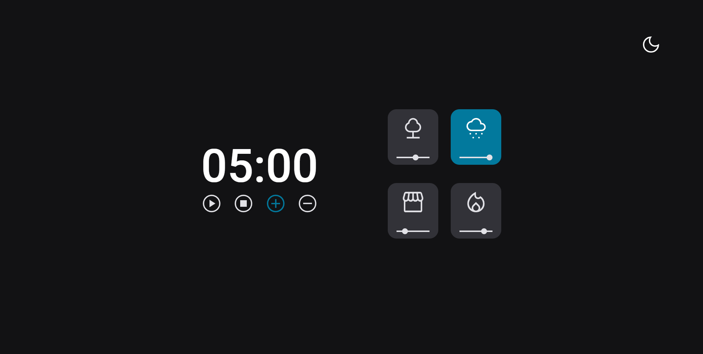
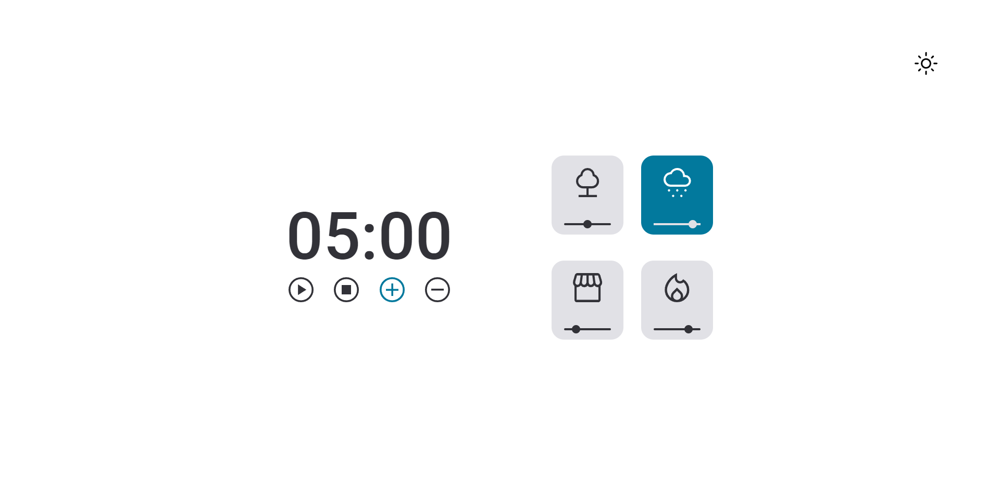

# "Focus Timer Dark Mode - Pomodoro"

 

Project building from "Rocktseat" classes.

[Click here to access project](https://hudsonsena.github.io/DesafioProjeto09/)

# Technologies

- HTML
- CSS
- JavaScript
- Git e GitHub

# Learning

- SVG style edits controls and cards
- scripts(functions, events, constant, variables, window, if, else)
- audios aplications
- input range for volume in cards
- light and dark modes
- export and import css style
- factoring method
- application of dependencies
- clean code

# Contact

hudsonsena93@gmail.com